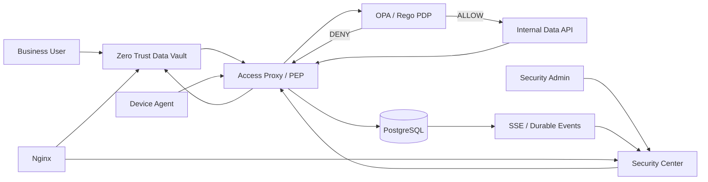
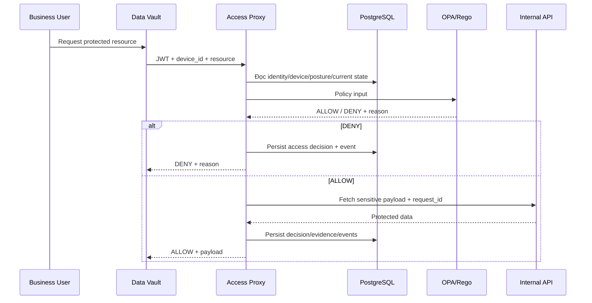

# Zero Trust Access Proxy + Continuous Device Trust

> **Đồ án môn Bảo mật dữ liệu**
> Prototype mô phỏng kiểm soát truy cập dữ liệu nội bộ theo kiến trúc **Zero Trust**, kết hợp **Continuous Device Trust**, **resource-aware authorization**, **policy-as-code**, **identity governance**, **realtime monitoring** và **audit evidence**.

<p align="center">
  
</p>

---

## 1. Giới thiệu

Trong các mô hình kiểm soát truy cập truyền thống, việc người dùng đăng nhập thành công thường tạo ra một mức tin cậy kéo dài cho toàn bộ phiên làm việc. Cách tiếp cận này không còn phù hợp khi trạng thái thiết bị, vai trò người dùng, mức độ nhạy cảm của dữ liệu hoặc ngữ cảnh truy cập có thể thay đổi trong suốt phiên.

Project này áp dụng nguyên tắc:

> **Không mặc định tin cậy chỉ vì người dùng đã đăng nhập. Mỗi protected request phải được đánh giá lại bằng trạng thái hiện tại của identity, device, context và resource sensitivity.**

Một JWT hợp lệ chỉ chứng minh rằng user đã được xác thực. Quyết định cuối cùng `ALLOW` hay `DENY` còn phụ thuộc vào:

- danh tính và trạng thái tài khoản;
- business role hiện tại;
- managed device đã đăng ký hay chưa;
- trust state của thiết bị;
- độ mới của heartbeat;
- firewall posture;
- patch evidence;
- pending reboot;
- request method và context;
- độ nhạy của resource;
- policy được định nghĩa bằng OPA/Rego.

Mục tiêu của hệ thống không chỉ là chặn hoặc cho phép truy cập. Mỗi quyết định còn phải tạo ra **bằng chứng có thể giải thích, lưu trữ và truy vết**.

---

## 2. Mục tiêu của đồ án

Project tập trung vào các mục tiêu chính:

1. Áp dụng tư duy **Zero Trust** vào một luồng truy cập dữ liệu cụ thể.
2. Tách **authentication** khỏi **authorization**.
3. Đánh giá lại từng protected request thay vì tin cậy toàn bộ session.
4. Kết hợp **identity**, **device posture**, **business role**, **request context** và **resource sensitivity** trong policy.
5. Dùng **Open Policy Agent (OPA)** làm Policy Decision Point.
6. Dùng Access Proxy làm Policy Enforcement Point.
7. Lưu decision evidence phục vụ audit và giải thích.
8. Minh họa continuous device trust bằng Device Agent và heartbeat.
9. Hỗ trợ realtime monitoring cho Security Center.
10. Xây dựng identity governance theo nguyên tắc least privilege.
11. Tạo demo tái hiện rõ các trạng thái `ALLOW` và `DENY`.
12. Đánh giá prototype bằng regression test và benchmark cục bộ.

---

## 3. Các nguyên tắc Zero Trust được thể hiện

### 3.1. Authentication không đồng nghĩa với authorization

User có thể đăng nhập thành công nhưng vẫn bị từ chối khi:

- thiết bị chưa trusted;
- heartbeat stale;
- firewall posture không đạt;
- patch evidence không đạt;
- máy đang pending reboot;
- business role không đủ cho HIGH data;
- context không hợp lệ.

### 3.2. Healthy device không thay thế business authorization

Một thiết bị có thể:

```text
registered
+ trusted
+ heartbeat fresh
+ firewall enabled
+ patch compliant
```

nhưng user vẫn có thể bị `DENY` nếu business role không đủ.

Ví dụ:

```text
bob
role = viewer
device = trusted
posture = healthy
resource = HIGH
→ DENY
→ ROLE_DENIED_FOR_HIGH_DATA
```

### 3.3. Business role không thay thế device trust

Ngược lại, một user `analyst` vẫn có thể bị chặn nếu device chưa trusted hoặc posture không đạt.

### 3.4. Quyết định luôn dựa trên current state

Protected request sử dụng trạng thái hiện tại trong hệ thống. Vì vậy:

- trust state mới có thể thay đổi request tiếp theo;
- posture mới có thể thay đổi request tiếp theo;
- role mới có thể thay đổi request tiếp theo;
- prototype không bắt buộc user login lại sau mỗi thay đổi role.

---

## 4. Kiến trúc tổng thể



### 4.1. Các thành phần chính

| Thành phần | Vai trò |
|---|---|
| **Zero Trust Data Vault** | Portal cho business user yêu cầu protected data |
| **Access Proxy** | Policy Enforcement Point, authentication, policy-input aggregation và enforcement |
| **OPA / Rego** | Policy Decision Point, trả `ALLOW` / `DENY` |
| **Internal API** | Chứa sensitive payload, chỉ được gọi sau `ALLOW` |
| **PostgreSQL** | Lưu identity/device state, posture history, access logs, security events và realtime events |
| **Device Agent** | Gửi endpoint posture và heartbeat |
| **Security Center** | Control-plane UI cho monitoring, trust control và identity governance |
| **SSE** | Realtime wake-up path cho Security Center |
| **Nginx** | Reverse proxy cho các portal/API trong lab |

Các service Docker Compose chính:

```text
postgres
opa
internal-api
access-proxy
dashboard
nginx
data-vault
```

---

## 5. Luồng xử lý một protected request



Điểm quan trọng là **Internal API không được gọi trước khi OPA trả về `ALLOW`**.

---

## 6. Resource-aware authorization

Hệ thống có ba resource mẫu:

| ID | Resource | Data owner | Sensitivity |
|---:|---|---|---|
| 1 | Customer Account Summary | Aurora Retail | LOW |
| 2 | Financial Risk Assessment | BluePeak Finance | MEDIUM |
| 3 | Restricted Security Investigation | NovaSec Industries | HIGH |

### 6.1. LOW

```text
authenticated
+ registered device
+ valid GET
```

LOW được thiết kế để minh họa rằng không phải mọi degraded posture đều phải dẫn tới cùng một policy result.

### 6.2. MEDIUM

```text
authenticated
+ registered device
+ trusted device
+ fresh heartbeat
+ valid GET
```

### 6.3. HIGH

```text
authenticated
+ registered device
+ privileged business role
+ trusted device
+ fresh heartbeat
+ firewall enabled
+ patch compliant
+ no pending reboot
+ allowed context
+ valid GET
```

### 6.4. Một số decision reason tiêu biểu

```text
DEVICE_UNTRUSTED
DEVICE_STALE
ROLE_DENIED_FOR_HIGH_DATA
FIREWALL_DISABLED
PATCH_EVIDENCE_MISSING
PENDING_REBOOT
PATCH_TOO_OLD
CONTEXT_DENIED
REQUEST_DENIED
ALLOW
```

---

## 7. Identity Governance và least privilege

Project tách rõ **business role** và **control-plane role**.

### 7.1. Business role

```text
VIEWER
  │
  │ job function / need-to-know
  ▼
ANALYST
```

- `viewer`: role mặc định, áp dụng nguyên tắc least privilege.
- `analyst`: business role nâng cao, có eligibility truy cập HIGH data nếu các điều kiện khác cùng đạt.

### 7.2. Protected control-plane role

```text
SECURITY-ADMIN
```

`security-admin` là role dành cho security/control plane. Đây **không phải** là phiên bản mạnh hơn của `analyst` và không thể được cấp qua workflow `VIEWER ↔ ANALYST`.

### 7.3. Enterprise-style provisioning flow

```text
Trusted administrator
        ↓
Provision business identity
        ↓
VIEWER + managed device
        ↓
Device starts UNTRUSTED
        ↓
Device Agent reports posture
        ↓
Heartbeat becomes FRESH
        ↓
SOC/IT makes explicit device-trust decision
        ↓
TRUSTED
        ↓
MEDIUM can ALLOW
        ↓
HIGH still requires ANALYST
        ↓
GRANT ANALYST when need-to-know justifies it
        ↓
Next protected request is reevaluated
```

Trong prototype, `device_id` được nhập khi provisioning để mô phỏng identity của managed endpoint. Trong môi trường enterprise thật, giá trị này thường đến từ asset inventory, MDM hoặc endpoint management platform.

---

## 8. Continuous Device Trust

Device Agent:

```text
device_agent/agent.py
```

Các posture signal chính:

- hostname / Windows version;
- Windows Firewall state;
- latest hotfix;
- patch age;
- pending reboot;
- patch compliance;
- heartbeat / `last_seen`.

Heartbeat được xem là stale sau khoảng:

```text
90 giây
```

Một process Device Agent đại diện cho một logical endpoint/device identity.

Ví dụ:

```powershell
# DEV-001
python .\device_agent\agent.py

# DEV-002
python .\device_agent\agent.py --device-id DEV-002

# Một device được provision thêm
python .\device_agent\agent.py --device-id DEV-003
```

Trong lab, nhiều logical device có thể chạy trên cùng một máy Windows bằng nhiều terminal riêng. Muốn nhiều device cùng có heartbeat `FRESH`, cần duy trì một agent instance cho mỗi `device_id`.

---

## 9. Demo Control Plane

Security Center có các control phục vụ việc trình diễn policy response:

| Control | Ý nghĩa |
|---|---|
| `TRUSTED / REVOKE` | Thay đổi gateway device-trust state trong prototype |
| `NORMAL / SIMULATE OFF` | Giả lập firewall telemetry bị tắt |
| `NORMAL / SIMULATE OLD` | Giả lập patch evidence quá cũ |
| `NORMAL / SIMULATE LOSS` | Giả lập mất posture/heartbeat delivery |

### Phân biệt trust control và simulation

`Device Trust` là trạng thái quản trị được gateway sử dụng trực tiếp khi policy evaluation.

Ba control Firewall / Patch / Heartbeat là **simulation phục vụ demo**. Chúng:

- không tắt Windows Firewall thật;
- không gỡ Windows Update;
- không làm thay đổi cấu hình hệ điều hành thật.

Mục tiêu là tạo trạng thái posture xấu theo cách an toàn, lặp lại được và dễ quan sát.

---

## 10. Zero Trust Data Vault

Data Vault là business-facing portal để user:

- login;
- xem metadata resource;
- xem mức sensitivity;
- gửi request truy cập;
- nhận `ALLOW` hoặc `DENY`;
- xem reason và decision evidence liên quan.

<p align="center">
  
</p>

Sensitive payload không được tải trước. Payload chỉ được fetch sau khi Access Proxy nhận kết quả `ALLOW` từ OPA.

---

## 11. Security Center

Security Center là control-plane UI để:

- theo dõi Zero Trust decisions;
- xem device trust và posture;
- xem heartbeat freshness;
- sử dụng demo control;
- quản lý business identity;
- thực hiện Viewer ↔ Analyst role assignment;
- inspect request correlation;
- theo dõi realtime security event;
- xem audit evidence.

### 11.1. Identity Administration

Business identity mới được provision theo mặc định:

```text
role = viewer
device = registered
trust = untrusted
```

<p align="center">
  
</p>

Role elevation sử dụng confirmation modal riêng nhằm giảm thao tác cấp quyền nhầm và giúp operator quan sát context trước khi thay đổi role.

<p align="center">
  
</p>

### 11.2. Light/Dark theme

Phiên bản UI cuối hỗ trợ:

- Dark theme theo phong cách Security Operations;
- Light theme blue-forward với semantic colors rõ ràng;
- màu xanh, đỏ, vàng, cyan thể hiện trạng thái policy/posture;
- Decision Inspector giữ semantics khác nhau giữa successful path và denied path;
- denied connector được biểu diễn dạng đứt đoạn để thể hiện payload fetch không xảy ra.

---

## 12. Realtime monitoring và durable audit evidence

Một số event tiêu biểu:

```text
DEVICE_POSTURE_REPORTED
SECURITY_EVENT
ACCESS_DECISION
DATA_API_FETCHED
```

Security Center sử dụng mô hình:

```text
SSE        → fast wake-up path
REST       → authoritative reconciliation
Polling    → fallback
PostgreSQL → durable source of truth
```

Khi event mới tới, UI debounce ngắn rồi đọc lại authoritative state qua REST. Polling vẫn được giữ làm fallback nếu SSE reconnect hoặc bỏ lỡ event.

---

## 13. Request Correlation và Decision Inspector

Mỗi protected request có một:

```text
request_id
```

Correlation path:

```text
Data Vault
   ↓
Access Proxy
   ↓
OPA input
   ↓
Access Log
   ↓
Realtime Event
   ↓
Internal API (chỉ khi ALLOW)
```

Decision Inspector có thể hiển thị:

- decision / reason;
- request ID;
- policy version;
- identity snapshot;
- device & posture snapshot;
- resource sensitivity;
- request/context;
- OPA result;
- access-log evidence;
- realtime-event evidence;
- Data API fetch status.

<p align="center">
  
</p>

Invariant quan trọng:

```text
DENY  → không có DATA_API_FETCHED
ALLOW → request_id được propagate và verify tới Internal API
```

Ví dụ một user có device healthy nhưng role không đủ cho HIGH data:

<p align="center">
  
</p>

---

## 14. Tài khoản demo

> Các credential dưới đây chỉ dành cho **local academic lab**. Không sử dụng cho production.

| Username | Password | Device | Role |
|---|---|---|---|
| `alice` | `alice123` | `DEV-001` | `analyst` |
| `bob` | `bob123` | `DEV-002` | `viewer` |
| `socadmin` | `socadmin123` | `SOC-001` | `security-admin` |

Alice và Bob là demo fixture để regression nhanh. Business identity mới có thể được provision từ Identity & Access Administration.

---

## 15. Kết quả kiểm thử và QA

Project có hai lớp regression chính.

### 15.1. Policy regression

File:

```text
tests/policy_regression.py
```

Mục tiêu:

- gọi trực tiếp OPA HTTP API;
- kiểm tra policy behavior theo nhiều tổ hợp identity/device/posture/resource;
- xác nhận các reason quan trọng;
- tránh regression khi thay đổi Rego policy.

Kết quả tại checkpoint QA backend/policy:

```text
14 / 14 PASS
```

### 15.2. API regression

File:

```text
tests/api_regression.py
```

Mục tiêu:

- đi qua Access Proxy thật;
- kiểm tra authentication + policy-input aggregation + OPA decision + enforcement;
- xác nhận protected request trả đúng `ALLOW` / `DENY`;
- xác nhận HIGH data không bị fetch khi policy từ chối.

Kết quả tại checkpoint QA backend/policy:

```text
15 / 15 PASS
```

### 15.3. Các scenario đã xác nhận thủ công

| Scenario | Kết quả |
|---|---|
| Alice + healthy trusted device + HIGH | `200 ALLOW` |
| Bob + healthy trusted device + HIGH | `DENY · ROLE_DENIED_FOR_HIGH_DATA` |
| Clean Docker deployment + smoke check | PASS |
| DENY path không fetch Internal API payload | PASS |
| Request correlation / Decision Inspector | PASS |
| Realtime Security Center update | PASS |
| Light/Dark UI acceptance | PASS |

### 15.4. QA checkpoint và UI freeze

Backend/policy regression checkpoint:

```text
c7f60e5
tag: v1.5-final-qa
```

UI final polish commit:

```text
f60d0e9
feat: add light theme and finalize UI polish
```

Final UI commit chỉ thay đổi frontend/UI scope; backend, OPA policy và database schema không bị sửa trong vòng UI polish.

> Trước khi nộp bài hoặc tạo release cuối, nên chạy lại cả hai regression suite để tạo evidence mới trên đúng commit cuối cùng.

---

## 16. Benchmark

Benchmark artifact:

```text
benchmark.py
zt_benchmark_v14.csv
zt_benchmark_v14_summary.json
```

Phương pháp:

- local Docker Compose;
- 10 warm-up call mỗi scenario;
- 100 measured request mỗi scenario;
- single client;
- rotating scenario order.

| Scenario | Average | Median | P95 | Min | Max |
|---|---:|---:|---:|---:|---:|
| Direct Internal API | 2.868 ms | 2.646 ms | 4.258 ms | 1.641 ms | 4.673 ms |
| OPA-only | 2.773 ms | 2.391 ms | 4.362 ms | 1.514 ms | 11.317 ms |
| Full Zero Trust | 72.211 ms | 65.526 ms | 99.045 ms | 46.143 ms | 374.193 ms |

Observed local-lab overhead:

```text
Average absolute overhead : 69.343 ms
Average latency ratio     : 25.18x
Relative increase         : 2417.84%
Absolute P95 overhead     : 94.787 ms
```

Các con số trên là **end-to-end prototype latency**, không phải riêng OPA latency.

Full Zero Trust path còn gồm:

- Access Proxy processing;
- PostgreSQL state lookup;
- policy-input aggregation;
- OPA HTTP request;
- audit persistence;
- realtime-event persistence;
- Internal API call trên ALLOW path;
- serialization/network overhead trong local Docker environment.

Baseline khoảng `2.9 ms`, vì vậy tỷ lệ phần trăm tăng nhìn rất lớn. Benchmark này không phải load test hay scalability test.

---

## 17. Security hardening đã thực hiện

Các hardening chính:

- `JWT_SECRET` externalized sang `.env`;
- Internal API shared secret externalized sang `.env`;
- backend / Compose fail-closed khi secret bắt buộc bị thiếu;
- `.env` nằm trong `.gitignore`;
- Internal API yêu cầu internal shared secret;
- admin/monitoring endpoint yêu cầu `security-admin`;
- business-role workflow không thể cấp `security-admin`;
- sensitive payload chỉ fetch sau `ALLOW`;
- `request_id` được propagate và verify trên ALLOW path;
- control-plane role được tách khỏi business role;
- posture evidence và access decision được persist phục vụ audit.

---

## 18. Project structure

```text
zero-trust-access-proxy/
│
├── access_proxy/
│   └── app/
│       └── main.py
│
├── dashboard/
│   └── index.html
│
├── data_vault/
│   ├── src/
│   ├── nginx.conf
│   └── Dockerfile
│
├── device_agent/
│   ├── agent.py
│   └── requirements.txt
│
├── internal_api/
│   └── app/
│       └── main.py
│
├── migrations/
│
├── nginx/
│   └── nginx.conf
│
├── opa/
│   └── policy.rego
│
├── tests/
│   ├── policy_regression.py
│   └── api_regression.py
│
├── docs/
│   └── screenshots/
│
├── benchmark.py
├── docker-compose.yml
├── README.md
├── RUN_DEMO.md
├── .env.example
├── .gitignore
├── zt_benchmark_v14.csv
└── zt_benchmark_v14_summary.json
```

---

## 19. Hướng dẫn chạy và demo

Để README tập trung vào kiến trúc, thiết kế và kết quả kỹ thuật, toàn bộ hướng dẫn thao tác được tách sang:

> **[RUN_DEMO.md](RUN_DEMO.md)**

File này bao gồm:

- chuẩn bị môi trường;
- tạo local secret;
- build Docker stack;
- chạy Device Agent;
- tài khoản demo;
- kịch bản Zero Trust end-to-end;
- negative posture scenario;
- regression test;
- troubleshooting;
- lưu ý tránh xóa nhầm Docker volume.

---

## 20. Giới hạn của prototype

Đây là **academic/local-lab prototype**, không phải production deployment.

Các giới hạn chủ động chấp nhận:

1. Local HTTP, chưa triển khai TLS/mTLS.
2. Native `EventSource` có giới hạn với custom `Authorization` header; lab SSE có caveat riêng về token transport.
3. `DEMO_ADMIN_KEY` là demo-only control token, không phải production privileged credential.
4. Device Agent chưa có hardware-backed attestation hoặc device certificate.
5. Identity lifecycle chưa tích hợp enterprise IdP / SSO / SCIM.
6. `security-admin` được bootstrap ngoài business-role workflow; project chưa triển khai PAM đầy đủ.
7. Firewall / Patch / Heartbeat controls là simulation phục vụ demo.
8. Benchmark là local single-client benchmark, không đại diện production capacity.
9. Project chưa triển khai Kubernetes, SIEM/ELK, message broker hoặc distributed tracing platform.
10. Managed device identity trong lab được đơn giản hóa thành `device_id`; production cần tích hợp MDM/EDR/asset inventory và strong device identity.
11. Prototype tập trung vào minh họa Zero Trust access control, không phải một IAM/MDM platform hoàn chỉnh.

---

## 21. Giá trị kỹ thuật của project

Đây chủ yếu là một **Security / Backend Systems project** cho môn **Bảo mật dữ liệu**.

Project thể hiện các chủ đề:

- Zero Trust architecture;
- Policy Enforcement Point / Policy Decision Point;
- ABAC/resource-aware authorization;
- identity governance;
- continuous endpoint posture;
- policy-as-code;
- PostgreSQL-backed audit evidence;
- durable realtime event;
- SSE + REST reconciliation;
- request correlation;
- secret hardening;
- schema migration;
- regression testing;
- benchmark và performance interpretation;
- multi-service Docker architecture.

Project cũng có yếu tố data/system engineering thông qua posture-history ingestion, persistent audit/event data và correlation, nhưng trọng tâm vẫn là **Zero Trust access control và security evidence**.

---

## 22. Trạng thái feature

```text
V1.3  Persistent Security Events                 ✅
V1.4A Resource-aware / Sensitivity-aware ABAC    ✅
V1.4B Zero Trust Data Vault                      ✅
V1.4C Realtime SSE                               ✅
V1.4D Demo Control Plane                         ✅
V1.4E Request Correlation + Decision Inspector   ✅
FINAL  Regression                                ✅
FINAL  Benchmark                                 ✅
FINAL  Secret Hardening                          ✅
V1.5  Identity Lifecycle                         ✅
V1.5  User Provisioning                          ✅
V1.5  Viewer ↔ Analyst Role Assignment           ✅
V1.5  Protected security-admin role              ✅
V1.5  Realtime Security Center sync              ✅
V1.5  Identity UI final polish                   ✅
V2.3  Light/Dark UI final acceptance             ✅
```

---

## 23. Feature freeze

Tại checkpoint hiện tại, project nên ưu tiên:

- bug fix;
- regression verification;
- tài liệu;
- demo rehearsal;
- screenshot;
- packaging/submission cleanup.

Không nên mở rộng thêm major feature nếu không thực sự cần thiết cho scope môn học.

---

## 24. Kết luận

Project minh họa một điểm cốt lõi của Zero Trust:

> **Quyền truy cập không được quyết định một lần tại thời điểm login. Nó phải được đánh giá lại cho từng protected request dựa trên current identity, current device state, request context và độ nhạy của tài nguyên.**

Hệ thống kết hợp PEP, OPA/Rego, device posture, role governance, PostgreSQL audit evidence và realtime monitoring để biến quyết định `ALLOW` / `DENY` thành một luồng có thể quan sát và giải thích.

Đây không phải production Zero Trust platform, nhưng là một prototype đủ đầy để minh họa:

```text
verify identity
+ verify device
+ verify posture
+ verify role
+ verify context
+ verify resource sensitivity
→ evaluate policy
→ enforce decision
→ persist evidence
```

> **Never trust implicitly. Verify every protected request using current identity, device state, context and resource sensitivity — then persist evidence explaining why access was allowed or denied.**
