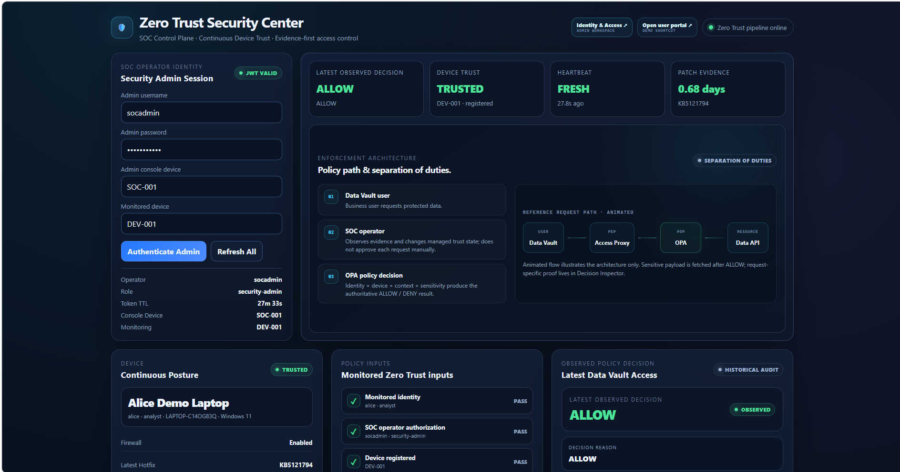
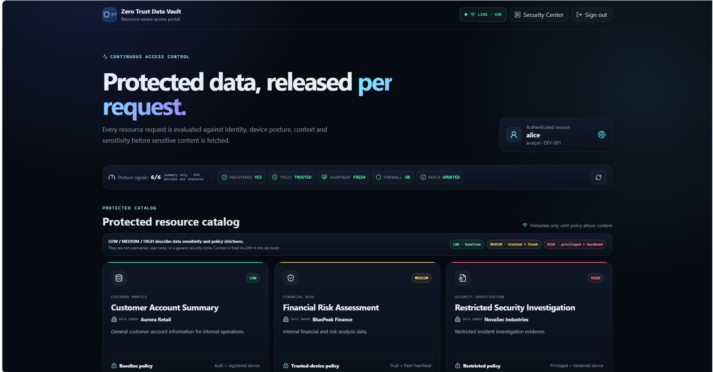
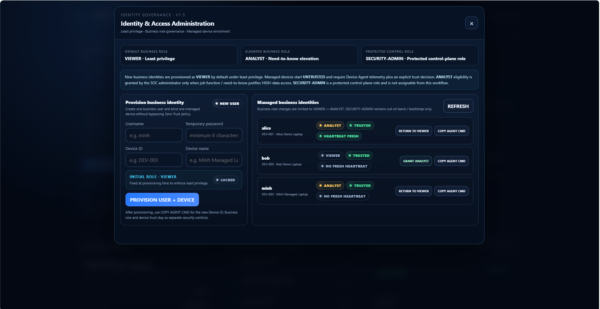
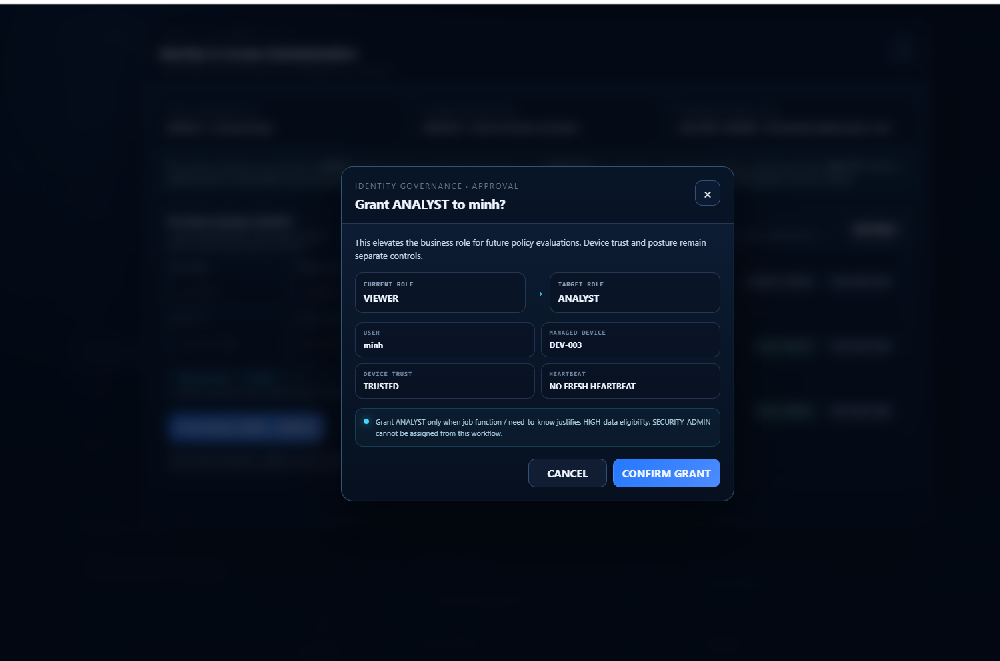
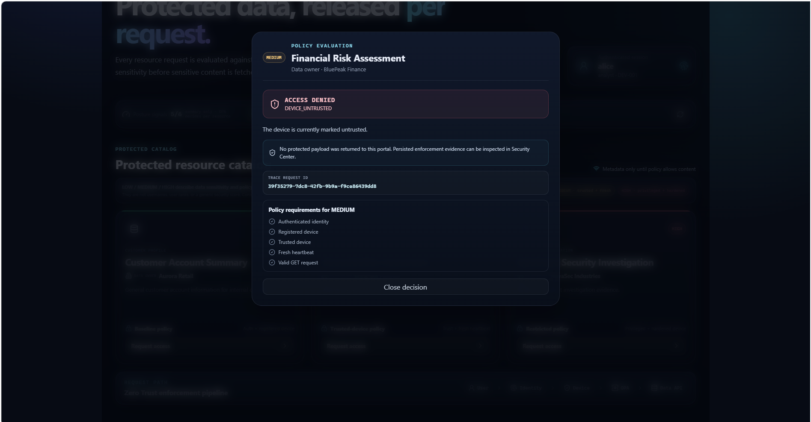
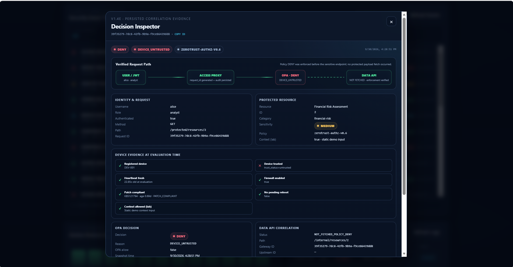
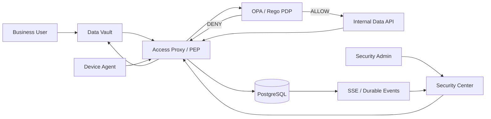

# Zero Trust Access Proxy + Continuous Device Trust

> **Đồ án môn Bảo mật dữ liệu · V1.5 FINAL**  
> Zero Trust Access Proxy kết hợp **Continuous Device Trust**, **resource-aware authorization**, **policy-as-code** và **audit evidence**.

<p align="center">
  
</p>

## Tổng quan

Project mô phỏng một hệ thống truy cập dữ liệu nội bộ theo mô hình **Zero Trust**. Một user đăng nhập thành công và có JWT hợp lệ **không đồng nghĩa** với việc các request tiếp theo luôn được phép.

Mỗi request tới tài nguyên được bảo vệ được đánh giá lại dựa trên:

- **Identity**: user hiện tại, trạng thái account, business role.
- **Device**: registered device và trust state.
- **Continuous posture**: heartbeat, firewall, patch evidence, pending reboot.
- **Context**: method và request context.
- **Resource sensitivity**: LOW / MEDIUM / HIGH.
- **Policy**: quyết định cuối cùng từ **Open Policy Agent (OPA/Rego)**.

Mục tiêu không chỉ là trả về `ALLOW` hoặc `DENY`, mà còn tạo ra **bằng chứng có thể giải thích, lưu trữ và truy vết** cho từng quyết định.

> **Thông điệp chính:** Không mặc định tin cậy chỉ vì người dùng đã đăng nhập. Mỗi protected request phải được đánh giá lại bằng trạng thái hiện tại của identity, device, context và resource.

---

## Demo nhanh

### Zero Trust Data Vault

Business user yêu cầu quyền truy cập dữ liệu theo từng resource. Metadata được hiển thị trước; sensitive payload chỉ được fetch sau khi policy trả về `ALLOW`.

<p align="center">
  
</p>

### Identity Governance

Business identity mới được provision với **VIEWER** theo nguyên tắc least privilege. Managed device bắt đầu ở trạng thái **UNTRUSTED**. `ANALYST` chỉ được cấp khi job function / need-to-know yêu cầu quyền truy cập HIGH data.

<p align="center">
  
</p>

Role elevation sử dụng confirmation modal riêng, đồng bộ với Security Center và hiển thị context của user/device trước khi thay đổi role.

<p align="center">
  
</p>

### Zero Trust enforcement

Một thiết bị có thể healthy, trusted và heartbeat fresh nhưng user vẫn bị chặn nếu business role không đủ cho resource sensitivity.

<p align="center">
  
</p>

Mỗi request có `request_id` để correlation giữa policy decision, access log, realtime event và Internal API fetch evidence.

<p align="center">
  
</p>

---

## Kiến trúc



### Thành phần

| Thành phần | Vai trò |
|---|---|
| **Data Vault** | Portal cho business user yêu cầu protected data |
| **Access Proxy** | Policy Enforcement Point (PEP), authentication và policy-input aggregation |
| **OPA / Rego** | Policy Decision Point (PDP), trả `ALLOW` / `DENY` |
| **Internal API** | Chứa sensitive payload; chỉ được gọi sau `ALLOW` |
| **PostgreSQL** | Lưu identity/device state, posture history, access logs, security events và realtime events |
| **Device Agent** | Thu thập endpoint posture và heartbeat |
| **Security Center** | Control-plane UI cho monitoring, trust control và identity governance |
| **SSE** | Realtime wake-up path cho Security Center |
| **Nginx** | Reverse proxy cho các portal/API trong lab |

Các service Docker Compose chính:

```text
postgres
opa
internal-api
access-proxy
dashboard
nginx
data-vault
```

---

## Resource-aware policy

Ba resource mẫu có độ nhạy khác nhau:

| ID | Resource | Data owner | Sensitivity |
|---:|---|---|---|
| 1 | Customer Account Summary | Aurora Retail | LOW |
| 2 | Financial Risk Assessment | BluePeak Finance | MEDIUM |
| 3 | Restricted Security Investigation | NovaSec Industries | HIGH |

### LOW

Yêu cầu cơ bản:

```text
authenticated
+ registered device
+ valid GET
```

LOW có thể vẫn được phép khi một số posture/trust signal đang degraded.

### MEDIUM

```text
authenticated
+ registered
+ trusted device
+ fresh heartbeat
```

### HIGH

```text
authenticated
+ registered
+ privileged business role
+ trusted device
+ fresh heartbeat
+ firewall enabled
+ patch compliant
+ no pending reboot
+ allowed context
+ valid GET
```

Các reason tiêu biểu:

```text
DEVICE_UNTRUSTED
DEVICE_STALE
FIREWALL_DISABLED
PATCH_TOO_OLD
PENDING_REBOOT
ROLE_DENIED_FOR_HIGH_DATA
ALLOW
```

---

## Identity Lifecycle V1.5

Hệ thống tách **business role** và **control-plane role**.

### Business roles

```text
VIEWER
   │
   │ job function / need-to-know
   ▼
ANALYST
```

- `viewer`: role mặc định, least privilege.
- `analyst`: role business nâng cao, có eligibility cho HIGH data khi các policy condition khác cùng đạt.

### Protected control-plane role

```text
SECURITY-ADMIN
```

`security-admin` không phải là “analyst mạnh hơn”. Đây là role quản trị security/control plane và **không thể được gán qua workflow VIEWER ↔ ANALYST**.

Flow provisioning:

```text
Trusted administrator
        ↓
Provision business identity
        ↓
VIEWER + registered managed device
        ↓
Device starts UNTRUSTED
        ↓
Device Agent reports posture
        ↓
Heartbeat becomes FRESH
        ↓
SOC makes explicit device-trust decision
        ↓
TRUSTED
        ↓
MEDIUM can ALLOW
        ↓
HIGH still requires ANALYST
        ↓
GRANT ANALYST when need-to-know justifies it
        ↓
Next protected request is reevaluated
```

Điểm đáng chú ý: protected request dùng **role hiện tại trong database**, vì vậy khi `VIEWER → ANALYST`, request tiếp theo có thể thay đổi quyết định **mà không bắt buộc user phải login lại**.

---

## Continuous Device Trust

Device Agent:

```text
device_agent/agent.py
```

Các signal chính:

- hostname / Windows version;
- Windows Firewall state;
- latest hotfix;
- patch age;
- pending reboot;
- patch compliance;
- heartbeat / `last_seen`.

Heartbeat được xem là stale sau khoảng **90 giây**.

Một agent process đại diện cho một **logical device identity**:

```powershell
# DEV-001
python .\device_agent\agent.py

# DEV-002
python .\device_agent\agent.py --device-id DEV-002

# Custom provisioned device
python .\device_agent\agent.py --device-id DEV-003
```

Trong lab, nhiều logical device có thể cùng chạy trên một máy Windows; muốn nhiều device cùng `FRESH` tại cùng thời điểm thì chạy một agent instance cho mỗi `device_id`.

---

## Demo Control Plane

Security Center có các control phục vụ demo:

| Control | Ý nghĩa |
|---|---|
| `TRUSTED / REVOKE` | Thay đổi gateway device-trust state thật trong prototype |
| `NORMAL / SIMULATE OFF` | Giả lập firewall telemetry bị tắt |
| `NORMAL / SIMULATE OLD` | Giả lập patch evidence quá cũ |
| `NORMAL / SIMULATE LOSS` | Giả lập mất posture/heartbeat delivery |

**Firewall / Patch / Heartbeat simulation không sửa Windows Firewall hoặc Windows Update thật.** Mục đích là tái hiện an toàn, lặp lại được các trạng thái posture xấu để quan sát policy response.

`Device Trust` khác với ba simulation trên: đây là control-plane trust state mà gateway sử dụng trực tiếp trong policy evaluation.

---

## Realtime monitoring và audit evidence

Các event tiêu biểu:

```text
DEVICE_POSTURE_REPORTED
SECURITY_EVENT
ACCESS_DECISION
DATA_API_FETCHED
```

Security Center sử dụng:

```text
SSE        → fast wake-up path
REST       → authoritative reconciliation
Polling    → fallback
PostgreSQL → durable source of truth
```

Khi event mới tới, UI debounce ngắn rồi đọc lại authoritative state từ REST. Polling định kỳ vẫn được giữ làm fallback khi SSE reconnect hoặc miss event.

---

## Request Correlation & Decision Inspector

Mỗi protected request có một UUID:

```text
request_id
```

Correlation path:

```text
Data Vault
   ↓
Access Proxy
   ↓
OPA input
   ↓
Access Log
   ↓
Realtime Event
   ↓
Internal API (chỉ khi ALLOW)
```

Decision Inspector giúp kiểm tra:

- decision / reason;
- request ID;
- policy version;
- identity snapshot;
- device & posture snapshot;
- resource sensitivity;
- request/context;
- OPA result;
- access-log evidence;
- realtime-event evidence;
- Data API fetch status.

Invariant quan trọng:

```text
DENY  → không có DATA_API_FETCHED
ALLOW → request_id được propagate và verify tới Internal API
```

---

## Tài khoản demo

> Các credential dưới đây chỉ dành cho **local academic lab**, không sử dụng cho production.

| Username | Password | Device | Role |
|---|---|---|---|
| `alice` | `alice123` | `DEV-001` | `analyst` |
| `bob` | `bob123` | `DEV-002` | `viewer` |
| `socadmin` | `socadmin123` | `SOC-001` | `security-admin` |

Alice/Bob là demo fixtures để regression nhanh. V1.5 có thể provision thêm business identity mới từ **Identity & Access Administration**.

---

## Quick Start

### Yêu cầu

- Windows 10/11 cho Device Agent demo.
- Docker Desktop / Docker Engine.
- Docker Compose v2.
- Python 3.
- PowerShell.

### 1. Chuẩn bị Python environment cho agent

```powershell
python -m venv .venv
.\.venv\Scripts\Activate.ps1
pip install -r .\device_agent\requirements.txt
```

### 2. Tạo secret local

Copy `.env.example` thành `.env`, sau đó tạo hai secret ngẫu nhiên:

```powershell
$jwtSecret = python -c "import secrets; print(secrets.token_urlsafe(48))"
$internalSecret = python -c "import secrets; print(secrets.token_urlsafe(48))"

@"
JWT_SECRET=$jwtSecret
INTERNAL_SHARED_SECRET=$internalSecret
"@ | Set-Content .\.env -Encoding ascii
```

`.env` **không được commit**.

### 3. Validate và khởi động

```powershell
docker compose config -q
docker compose up -d --build
docker compose ps
```

Mở:

```text
Security Center : http://localhost:8081
Data Vault      : http://localhost:8082
```

> Khi dùng database volume mới, áp dụng các migration SQL trong `migrations/` theo thứ tự số `001 → 005` phù hợp với state của database.

---

## Kịch bản demo khuyến nghị

Một flow ngắn nhưng thể hiện gần như toàn bộ ý tưởng của project:

```text
1. SOC provision user mới
   → VIEWER + DEV-003 UNTRUSTED

2. User login Data Vault
   → LOW ALLOW
   → MEDIUM/HIGH DENY DEVICE_UNTRUSTED

3. Start DEV-003 Device Agent
   → heartbeat FRESH
   → firewall/patch evidence healthy
   → device vẫn UNTRUSTED

4. SOC TRUST DEV-003
   → MEDIUM ALLOW
   → HIGH DENY ROLE_DENIED_FOR_HIGH_DATA

5. SOC GRANT ANALYST
   → không login lại
   → request HIGH lần nữa
   → ALLOW

6. Security Center
   → realtime decision update
   → audit evidence
   → Decision Inspector / request correlation
```

Flow này cho thấy rõ:

- login không đồng nghĩa được tin cậy mãi;
- healthy device không thay thế business authorization;
- business role không thay thế device trust;
- role và trust là hai control độc lập;
- request mới luôn được reevaluate bằng current state.

---

## Benchmark

Benchmark artifact:

```text
benchmark.py
zt_benchmark_v14.csv
zt_benchmark_v14_summary.json
```

Phương pháp:

- local Docker Compose;
- 10 warm-up calls mỗi scenario;
- 100 measured requests mỗi scenario;
- single client;
- rotating scenario order.

| Scenario | Average | Median | P95 | Min | Max |
|---|---:|---:|---:|---:|---:|
| Direct Internal API | 2.868 ms | 2.646 ms | 4.258 ms | 1.641 ms | 4.673 ms |
| OPA-only | 2.773 ms | 2.391 ms | 4.362 ms | 1.514 ms | 11.317 ms |
| Full Zero Trust | 72.211 ms | 65.526 ms | 99.045 ms | 46.143 ms | 374.193 ms |

Observed local-lab overhead:

```text
Average absolute overhead : 69.343 ms
Average latency ratio     : 25.18x
Relative increase         : 2417.84%
Absolute P95 overhead     : 94.787 ms
```

Các số trên là **end-to-end prototype latency**, không phải riêng OPA latency. Baseline chỉ khoảng `2.9 ms`, vì vậy tỷ lệ phần trăm nhìn rất lớn. Benchmark này cũng **không phải load/scalability test**.

---

## Security hardening

Các hardening đã thực hiện:

- `JWT_SECRET` externalized sang `.env`.
- Internal API shared secret externalized sang `.env`.
- Backend / Compose fail-closed khi secret bắt buộc bị thiếu.
- `.env` nằm trong `.gitignore`.
- Internal API yêu cầu internal shared secret.
- Admin/monitoring endpoint yêu cầu `security-admin`.
- Business-role workflow không thể cấp `security-admin`.
- Sensitive payload chỉ fetch sau `ALLOW`.
- `request_id` được propagate và verify trên ALLOW path.

---

## Project structure

```text
zero-trust-access-proxy/
│
├── access_proxy/
│   └── app/
│       └── main.py
│
├── dashboard/
│   └── index.html
│
├── data_vault/
│   ├── src/
│   ├── nginx.conf
│   └── Dockerfile
│
├── device_agent/
│   ├── agent.py
│   └── requirements.txt
│
├── internal_api/
│   └── app/
│       └── main.py
│
├── migrations/
├── nginx/
│   └── nginx.conf
├── opa/
│   └── policy.rego
│
├── docs/
│   └── screenshots/
│
├── benchmark.py
├── docker-compose.yml
├── README.md
├── .env.example
├── .gitignore
├── zt_benchmark_v14.csv
└── zt_benchmark_v14_summary.json
```

---

## Giới hạn của prototype

Đây là **academic/local-lab prototype**, không phải production deployment.

Các giới hạn chủ động chấp nhận:

1. HTTP localhost, chưa triển khai TLS/mTLS.
2. Native `EventSource` không gửi custom `Authorization` header, nên lab SSE có caveat về cách truyền token.
3. `DEMO_ADMIN_KEY` là demo-only control token, không phải production privileged credential.
4. Device Agent chưa có hardware-backed attestation hoặc device certificate.
5. Identity lifecycle chưa tích hợp enterprise IdP / SSO / SCIM.
6. `security-admin` được bootstrap ngoài business-role workflow; project không triển khai PAM đầy đủ.
7. Firewall / Patch / Heartbeat demo controls là simulation.
8. Benchmark là local single-client benchmark, không đại diện production capacity.
9. Project không triển khai Kubernetes, SIEM/ELK, message broker hoặc distributed tracing platform vì nằm ngoài scope môn học.

---

## Góc nhìn kỹ thuật

Đây chủ yếu là một **Security / Backend Systems project** cho môn **Bảo mật dữ liệu**.

Project cũng có một số yếu tố hữu ích về data/system engineering như:

- persistent audit/event data trong PostgreSQL;
- posture-history ingestion;
- durable realtime events;
- request correlation;
- schema migrations;
- benchmark artifact;
- multi-service containerized data flow.

Tuy nhiên project **không được trình bày như một Data Engineering pipeline thuần túy**; trọng tâm vẫn là **Zero Trust access control và security evidence**.

---

## Trạng thái

```text
V1.3  Persistent Security Events                 ✅
V1.4A Resource-aware / Sensitivity-aware ABAC    ✅
V1.4B Zero Trust Data Vault                      ✅
V1.4C Realtime SSE                               ✅
V1.4D Demo Control Plane                         ✅
V1.4E Request Correlation + Decision Inspector   ✅
FINAL  Regression                                ✅
FINAL  Benchmark                                 ✅
FINAL  Secret Hardening                          ✅
V1.5  Identity Lifecycle                         ✅
V1.5  User Provisioning                          ✅
V1.5  Viewer ↔ Analyst Role Assignment           ✅
V1.5  Protected security-admin role              ✅
V1.5  Realtime Security Center sync              ✅
V1.5  Identity UI final polish                   ✅
```

## V1.5 FINAL — Feature Freeze 🔒

Từ checkpoint này, project chỉ nên nhận:

- bug fix;
- tài liệu;
- demo rehearsal;
- packaging/submission cleanup.

---

## Ghi chú

Project được xây dựng cho mục đích học tập và trình diễn các nguyên tắc Zero Trust trong môn **Bảo mật dữ liệu**.

> **Never trust implicitly. Verify every protected request using current identity, device state, context and resource sensitivity — then persist evidence explaining why access was allowed or denied.**
